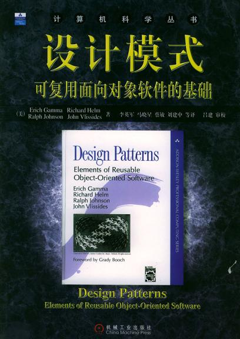

# 设计模式学习笔记（李建忠老师）

## 1. 设计模式简介

&emsp; **什么是设计模式**
&emsp; &emsp; 模式描述了一个**不断重复发生**的问题以及**解决方案核心**

&emsp; **GOF设计模式**

&emsp; &emsp;

<!-- &emsp; &emsp; </img> -->

&emsp; &emsp; 历史性的著作 《设计模式：可复用面向对象软件的基础》
&emsp; &emsp; 关键词：可复用、面向对象（现代设计模式隐含表示面向对象设计模式但不等于）

&emsp; **如何解决复杂性**
&emsp; 自然的想法：
&emsp;&emsp; 1. 分解
&emsp;&emsp; 2. **抽象**：可复用性更强
