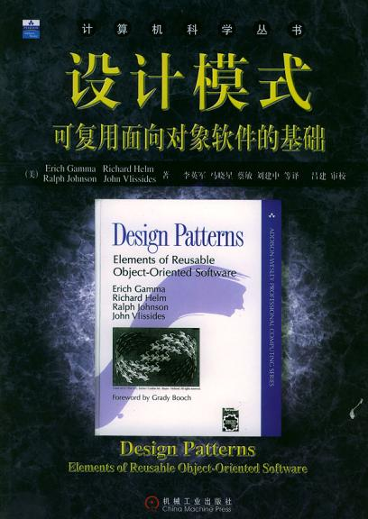

# 设计模式学习笔记（李建忠老师）

## 1. 设计模式简介

&emsp; **什么是设计模式**
&emsp; &emsp; 模式描述了一个**不断重复发生**的问题以及**解决方案核心**

&emsp; **GOF设计模式**

&emsp; &emsp;

<!-- &emsp; &emsp; </img> -->

&emsp; &emsp; 历史性的著作 《设计模式：可复用面向对象软件的基础》
&emsp; &emsp; 关键词：可复用、面向对象（现代设计模式隐含表示面向对象设计模式但不等于）

&emsp; **如何解决复杂性**
&emsp; 自然的想法：
&emsp;&emsp; 1. 分解
&emsp;&emsp; 2. **抽象**：可复用性更强

## 2. 面对对象设计原则

设计模式关心可复用性，**变化**是**复用**的天敌，而面向对象设计的优势在于==抵御变化==，将变化带来的影响降低

对面向对象的认识

1. 对象是拥有某种责任的抽象
2. 各司其职：面向对象强调各个类的“责任”

### 面对对象设计原则

设计模式应依赖、遵守设计原则，设计原则是评判设计模式的标准，违背设计原则的设计模式可以认为是错误的

1. 依赖倒置原则（DIP）
   - 高层模块（稳定）不应该依赖于低层模块（变化），二者都应依赖于抽象（稳定）
   - 抽象（稳定）不应该依赖于实现细节（变化），==实现细节应依赖于抽象（稳定）==
2. 开放封闭原则（OCP）
   - 对拓展开放，对更改封闭
   - 类模块应该设计成是可拓展的，不必修改的（即不需要改代码）
3. 单一职责原则（SRP）
   - 一个类应该仅有一个引起它变化的原因
   - 变化的方向隐含类的责任
4. Liskov（里氏）替换原则（LSP）
   - 子类必须能够替换他们的基类（IS—A关系）
   - 继承表达类型抽象
5. 接口隔离原则（ISP）
   - 接口应该小而完备，
   - 不需要暴露给客户它们不用的方法，否则可能产生依赖关系
6. 优先使用对象组合，而不是类继承
   - 类继承通常为“白箱复用”，对象组合通常为“黑箱复用”
   - 继承破坏了封装性，子类父类天然具有高的耦合性
   - 对象组合只要求被组合的对象具有良好定义的接口即可，耦合度相对较低
7. 封装变化点
   - 使用封装创建对象之间的分界层，让设计者可以在一侧进行修改而不对另一侧产生不良影响，实现层次间的松耦合
8. 针对接口编程，而不是针对实现编程
   - 如不在接口中使用具体业务class，应使用抽象类
   - 实现高内聚，松耦合

设计原则提升

1. 设计习语（Idioms）
  代码级别的底层模式、技巧、惯用法
2. 设计模式（patterns）
  对象直接的组织关系，包括角色、职责、协作方式等
3. 架构模式（Architectural）
  系统中与基本结构组织关系密切的高层模式，包括子系统划分，职责，以及如何组织他们之间关系的规则

## 组件协作模式（模式的分类）

”组件协作“模式包含的典型模型

- Template Method
- Observer / Event
- Strategy

重构到模式（Refactoring to Patterns）

- 好的面向对象设计模式应是满足“应对变化，提高复用”的设计
- 现代软件特征之一是“需求的频繁变化”，设计模式的要点是==寻找变化点，然后在变化点应用设计模式，从而来更好地应对需求的变化==
- ==什么时候、什么地方应用设计模式比理解设计模式的结构本身更重要==
- 倡导从重构到模式（除非特别熟悉业务），没有一步到位的设计模式，在开发过程中不断重构修正设计模式，避免误用设计模式

重构的关键技巧

- 静态 -> 动态
- 继承 -> 组合
- 早绑定 -> 晚绑定
- 编译时依赖 -> 运行时依赖
- 紧耦合 -> 松耦合

### 模板（稳定的样板）方法模式

#### 模板方法motivation

- 在软件构建过程中，对于某一项任务，它常常有==稳定的整体操作结构==，但各个子步骤却有很多改变的需求，或者由于固有的原因（比如框架与应用之间的关系）而无法和任务的整体结构同时实现。
- 如何在确定稳定操作结构的前提下，来灵活应对各个子步骤的变化或者晚期实现需求？

#### 早绑定与晚绑定

早绑定：后期实现的程序调用较早实现的方法
晚绑定：前期实现的程序调用后期实现的方法（利用虚函数等机制）

#### 模板方法类结构

&emsp; &emsp;

#### 模板方法总结

- 反向控制结构（晚绑定）
- c++使用虚函数的多态性可以简洁地实现

### 策略模式（Strategy）

#### 策略模式motivation

- 在软件构建过程中，某些对象使用的算法可能多种多样，**经常改变**，如果将这些算法都编码到对象中，将会使对象变得异常复杂；而且有时候支持不使用的算法也是一个性能负担
- 如何在运行时根据需要透明地更改对象的算法？将算法与对象本身解耦，从而避免上述问题？

#### 策略模式定义

GoF定义：定义一系列算法，把它们一个个封装起来，并且使它们可互相替换（变化）。该模式使得算法可独立于使用它的客户程序(稳定)而变化（扩展，子类化）。

#### 策略模式结构

&emsp; &emsp;

#### 策略模式总结

- Strategy及其子类为组件提供了一系列可重用的算法，从而可以使得类型在==运行时==（通过多态）方便地根据需要在各个算法之间进行切换。
- Strategy模式提供了用条件判断语句以外的另一种选择，==消除条件判断语句，就是在解耦合==。含有许多条件判断语句的代码通常都需要Strategy模式。
- *（暂未讲）如果Strategy对象没有实例变量，那么各个上下文可以共享同一个Strategy对象，从而节省对象开销。

### 观察者模式（Observer、Event）

#### 观察者模式motivation

- 在软件构建过程中，我们需要为某些对象建立一种“==通知依赖==关系”  即一个对象（目标对象）的状态发生改变，所有的依赖对象（观察者对象）都将得到通知。如果这样的依赖关系过于紧密，将使软件不能很好地抵御变化。
- 使用面向对象技术，可以将这种依赖关系弱化，并形成一种稳定的依赖关系。从而实现软件体系结构的松耦合。

#### 观察者模式定义

定义对象间的一种一对多（变化）的依赖关系，以便当一个对象(Subject)的状态发生改变时，所有依赖于它的对象都得到通知并自动更新。 ——《设计模式》GoF

#### 观察者模式结构

&emsp; &emsp;

#### 观察者模式总结

- 使用面向对象的抽象，Observer模式使得我们可以独立地改变目标与观察者，从而使二者之间的依赖关系达致松耦合。
- 目标发送通知时，无需指定观察者，通知（可以携带通知信息作为参数）会自动传播。
- 观察者自己决定是否需要订阅通知，目标对象对此一无所知。
- Observer模式是基于事件的UI框架中非常常用的设计模式，也是MVC模式的一个重要组成部分。

## 单一职责模式（模式的分类）

在软件组件的设计中，如果责任划分的不清晰，使用继承得到的结果往往是随着需求的变化，子类急剧膨胀，同时充斥着重复代码，这时候的关键是划清责任。

### 装饰模式 (Decorator)

#### 装饰模式motivation

在某些情况下我们可能会“过度地使用继承来扩展对象的功能”，由于继承为类型引入的静态特质，使得这种扩展方式缺乏灵活性（编译时已经确定）；并且随着子类的增多（扩展功能的增多），各种子类的组合（扩展功能的组合）会导致更多子类的膨胀。

如何使“对象功能的扩展”能够根据需要来动态地实现？同时避免“扩展功能的增多”带来的子类膨胀问题？从而使得任何“功能扩展变化”所导致的影响将为最低？

#### 装饰模式定义

动态（组合）地给一个对象增加一些额外的职责。就增加功能而言，Decorator模式比生成子类（继承）更为灵活（消除重复代码 & 减少子类个数）。 ——《设计模式》GoF

实现上，decorator继承目标对象同时组合目标对象，即对目标对象进行装饰

&emsp; &emsp;

#### 装饰模式总结

- 通过采用组合而非继承的手法， Decorator模式实现了在运行时动态扩展对象功能的能力，而且可以根据需要扩展多个功能。避免了使用继承带来的“灵活性差”和“多子类衍生问题”

- Decorator类在接口上表现为is-a Component的继承关系，即Decorator类继承了Component类所具有的接口。但在实现上又表现为has-a Component的组合关系，即Decorator类又使用了另外一个Component类。

- Decorator模式的目的并非解决“多子类衍生的多继承”问题，Decorator模式应用的要点在于解决“主体类在多个方向上的扩展功能”——是为“装饰”的含义。

- 使用继承，使得子类的虚函数继承了父类接口的规范、规格

### 桥模式 (Bridge)

#### 桥模式motivation

- 由于某些类型的固有的实现逻辑，使得它们具有两个变化的维度，乃至多个纬度的变化
- 如何应对这种“多维度的变化”？如何利用面向对象技术来使得类型可以轻松地沿着两个乃至多个方向变化，而不引入额外的复杂度？

#### 桥模式定义

将抽象部分(业务功能)与实现部分(平台实现)分离，使它们都可以独立地变化。 ——《设计模式》GoF

&emsp; &emsp;

#### 桥模式总结

- Bridge模式使用“对象间的组合关系”解耦了抽象和实现之间固有的绑定关系，使得抽象和实现可以沿着各自的维度来变化。所谓抽象和实现沿着各自纬度的变化，即“子类化”它们。
- Bridge模式有时候类似于多继承方案，但是多继承方案往往违背单一职责原则（即一个类只有一个变化的原因），复用性比较差。Bridge模式是比多继承方案更好的解决方法。
- Bridge模式的应用一般在“两个非常强的变化维度”，有时一个类也有多于两个的变化维度，这时可以使用Bridge的扩展模式。

## 对象创建协作模式（模式的分类）

通过“对象创建” 模式绕开new，来避免对象创建（new）过程中所导致的紧耦合（依赖具体类），从而支持对象创建的稳定。它是接口抽象之后的第一步工作。

- Factory Method
- Abstract Factory
- Prototype
- Builder

### 工厂方法模式（Factory Method）

#### 工厂方法模式motivation

- 在软件系统中，经常面临着创建对象的工作；由于需求的变化，需要创建的对象的具体类型经常变化。
- 如何应对这种变化？如何绕过常规的对象创建方法(new)，提供一种“封装机制”来避免客户程序和这种“具体对象创建工作”的紧耦合？

#### 工厂方法模式定义

定义一个用于创建对象的接口，让子类决定实例化哪一个类。Factory Method使得一个类的实例化延迟（目的：解耦，手段：虚函数）到子类。 ——《设计模式》GoF
&emsp; &emsp;

#### 工厂方法模式总结

- Factory Method模式用于隔离类对象的使用者和具体类型之间的耦合关系。面对一个经常变化的体类型，紧耦合关系(new)会导致软件的脆弱。
- Factory Method模式通过面向对象的手法，将所要创建的具体对象工作延迟到子类，从而实现一种扩展（而非更改）的策略，较好地解决了这种紧耦合关系。
- Factory Method模式解决“单个对象”的需求变化。缺点在于要求创建方法/参数相同。

### 抽象工厂模式（Factory Method）

#### 抽象工厂模式motivation

- 在软件系统中，经常面临着“一系列相互依赖的对象”的创建工作；同时，由于需求的变化，往往存在更多系列对象的创建工作。
- 如何应对这种变化？如何绕过常规的对象创建方法(new)，提供一种“封装机制”来避免客户程序和这种“多系列具体对象创建工作”的紧耦合？

#### 抽象工厂模式定义

提供一个接口，让该接口负责创建一系列“相关或者相互依赖的对象”，无需指定它们具体的类。 ——《设计模式》GoF
&emsp; &emsp;

#### 抽象工厂模式总结

- 如果没有应对“多系列对象构建”的需求变化，则没有必要使用Abstract Factory模式，这时候使用简单的工厂完全可以。
- “系列对象”指的是在某一特定系列下的对象之间有相互依赖、或作用的关系。不同系列的对象之间不能相互依赖。
- Abstract Factory模式主要在于应对“新系列”的需求变动。其缺点在于难以应对“新对象”的需求变动。

### 原型模式（Prototype）

#### 原型模式motivation

- **复杂对象**的创建，这些对象经常面临变化，却拥有稳定的接口
- 如何应对这种变化？如何使客户程序（使用这些对象的程序）隔离出这些易变对象，从而使得依赖于这些易变对象的客户程序不随需求改变而改变

#### 原型模式定义

使用原型实例制定创建对象的种类，然后通过拷贝这些原型来创建新的对象。 ——《设计模式》GoF

&emsp; &emsp;

#### 原型模式总结

- Prototype 模式同样用于隔离类对象的使用者和具体类型（易变类）之间的耦合关系，它同样要求这些“易变类”拥有“稳定的接口”。
- Prototype 模式对于“如何创建易变类的实体对象”采用“原型克隆”的方法来做，它使得我们可以非常灵活地动态创建“拥有某些稳定接口”的新对象——所需工作仅仅是注册一个新类的对象（即原型），然后在任何需要的地方Clone。
- 通过clone直接继承了原型的状态

### 构建器模式（Builder）

#### 构建器模式motivation

- 在软件系统中，有时候面临着“一个复杂对象”的创建工作，其通常由各个部分的子对象用一定的算法构成；由于需求的变化，这个复杂对象的各个部分经常面临着剧烈的变化，但是将它们组合在一起的算法却相对稳定。（与模板方法的应用场景类似，这里主要面向对象创建）
- 如何应对这种变化？如何提供一种“封装机制”来隔离出“复杂对象的各个部分”的变化，从而保持系统中的“稳定构建算法”不随着需求改变而改变？

#### 构建器模式定义

将一个复杂对象的构建与其表示相分离，使得同样的构建过程(稳定)可以创建不同的表示(变化)。 ——《设计模式》GoF

&emsp; &emsp;

#### 构建器模式总结

- Builder 模式主要用于“分步骤构建一个复杂的对象”。在这其中“分步骤”是一个稳定的算法，而复杂对象的各个部分则经常变化
- 变化点在哪里，封装哪里—— Builder模式主要在于应对“复杂对象各个部分”的频繁需求变动。其缺点在于难以应对“分步骤构建算法”的需求变动
- 在Builder模式中，要注意不同语言中构造器内调用虚函数的差别（C++ vs. C#) c++构造函数中不能调用子类的虚函数

## 对象性能模式（模式的分类）

通常面向对象的成本可以忽略不计，但是某些情况，面向对象带来的成本必须谨慎处理
本类型设计模式就是为了解决这样的问题

- 单例模式
- 享元模式

### 单例模式（Singleton）

#### 单例模式motivation

- 软件系统中经常有这样一些特殊的类，必须保证它们在系统中只存在一个实例才能确保它们的逻辑正确性、以及良好的效率
- 如何提供一种机制来保证一个类只有一个实例?

#### 单例模式定义

保证一个类仅有一个实例，并提供一个该实例的全局访问点。 ——《设计模式》GoF

#### 单例模式总结

- 单例模式中的实例构造器可以设置为protected以允许子类派生
- 单例模式一般支持拷贝构造函数以及clone接口，因为这可能导致有多个实例存在
- 具体怎么实现？注意双检查锁的正确实现

### 享元模式（Flyweight）

#### 享元模式motivation

- 在软件系统采用纯粹对象方案的问题在于大量细粒度（有重复，可复用）的对象会很快充斥在系统中，从而带来很高的运行时代价--主要指内存需求方面的代价
- 如何在避免大量细粒度对象问题的同时，让外部客户程序仍然能够透明地使用面向对象的方式来操作

#### 享元模式定义

运用共享技术有效地支持大量细粒度的对象。 ——《设计模式》GoF

#### 享元模式总结

xxx

## 接口隔离模式（设计模式分类）

在组件构建过程中，某些接口之间直接的依赖常常会带来很多问题、甚至根本无法实现。采用添加一层间接（稳定的）接口，来隔离本来互相紧密关联的接口是一种常见的解决方案（比如os）

- Facade （门面模式）
- Proxy （代理模式）
- Adapter （适配器模式）
- Mediator （中介模式）

### 门面模式（Facade）

通过添加中间层，降低系统间耦合的复杂度

&emsp; &emsp;

#### 门面模式motivation

- 上述A方案的问题在于组件的客户和组件中的各种复杂的子系统有了过多的耦合，随着外部客户程序和各子系统的演化，这种过多的的耦合面临很多变化的挑战
- 如何简化外部客户程序和系统间的交互接口？如何将外部客户程序的演化和内部子系统的变化之间的依赖相互解耦？

#### 门面模式定义

为子系统中的一组接口提供一个一致（稳定）的界面，Facade模式定义了一个高层接口，这个接口使得这一子系统更加容易使用（复用）。 ——《设计模式》GoF

#### 门面模式总结

- 从客户程序的角度来看，Facade模式简化了整个组件系统的接口，对于组件内部与外部客户程序来说，达到了一种"解耦"的效果---内部子系统的任何变化不会影响到facade接口的变化
- facade设计模式更注重从架构的层次去看整个系统，而不是单个类的层次。Facade很多时候更是一种架构设计模式
- Facade设计模式并非一个集装箱，可以任意地方进任何多个对象，该模式中组件的内部应该是"相互耦合关系比较大的一系列组件"，而不是一个简单的功能集合。

### 代理模式（Proxy）

#### 代理模式motivation

- 在系统中某些对象由于某种原因（比如对象创建的开销很大，或者某些操作需要安全控制，或者需要进程外的访问）无法或很难访问，或者直接访问会带来很多问题
- 如何在不失去透明操作对象的同时来管理、控制这些对象？
- 增加一个间接代理层是软件开发中常见的解决方式

#### 代理模式定义

为其他对象提供一种代理以控制（隔离，使用接口）对这个对象的访问。  ——《设计模式》GoF

#### 代理模式总结

- 增加一层间接层是软件系统中对许多复杂问题的一种常见解决方法
- 具体代理设计模式

### 适配器模式 (Adapter)

#### 适配器模式motivation

#### 适配器模式定义

将一个类的接口转换成客户希望的另一个接口。Adapter模式使得原本由于接口不兼容而不能一起工作的那些类可以工作。（接口转换的作用） ——《设计模式》GoF

&emsp; &emsp;

#### 适配器模式总结

- Adapter模式主要应用于"希望复用一些现存的类，但是接口又与复用环境要求不一致的情况"，在遗留代码复用、类库迁移等方面非常有用
- GoF23定义了两种Adapter模式的实现结构：对象适配器和类适配器。但类适配器采用“多继承”的实现方式，一般不推荐使用，对象适配器采用“对象组合”的方式，更符合松耦合精神
- Adapter模式可以实现的非常灵活，不必拘泥于Gof23中定义的两种结构。

### 中介者模式 (Mediator)

#### 中介者模式motivation

- 在软件构建过程中，经常会出现多个对象互相关联交互的情况，对象直接常常会维持一种复杂的引用关系，如果遇到一些需求的更改，这种直接的引用关系将面临不断的变化

- 在这种情况下，我们可以使用一个"中介对象"来管理对象间的关联关系，避免互相交互的对象之间的紧耦合引用关系，从而更好地抵御变化

#### 中介者模式定义

用一个中介对象来封装一系列的对象交互（封装变化）。中介者使各对象不需要显式的相互引用（编译时依赖->运行时依赖），从而使其耦合松散（管理变化），而且可以独立地改变他们之间的交互。 ——《设计模式》GoF

#### 中介者模式总结

- 将多个对象间复杂的关联关系解耦，mediator模式将多个对象间的控制逻辑进行集中管理，变"多个对象互相关联"为"多个对象和一个中介者关联"，简化了系统的维护，抵御了可能的变化
- 随着控制逻辑的复杂化，Mediator具体对象的实现可能相当复杂，这时候可以对Mediator对象进行分解处理
- Facade模式是解耦系统间（单向）的对象关联关系；Mediator模式是解耦系统内各个对象之间的（双向）的关联关系

### 接口隔离模式总结

- Facade （门面模式）：解耦系统间对象关系，设置中间层
- Proxy （代理模式）：设置代理对象处理两对象间复杂的性能、安全等问题
- Adapter （适配器模式）：适配旧接口到新接口
- Mediator （中介模式）：解耦系统内部的对象关联关系

## 状态变化 模式（模式分类）

在组件构建过程中，某些对象的状态经常面临变化，如何对这些变化进行有效的管理？同时又维持高层模块的稳定？

- State
- Memento

### 状态模式（State）

#### 状态模式motivation

- 在软件构建过程中，某些对象的状态如果改变，其行为也会随之而发生变化，比如文档处于只读状态，其支持的行为和读写状态支持的行为就可能完全不同。
- 如何在运行时根据对象的状态来透明地更改对象的行为？ 而不会为对象操作和状态转化之间引入紧耦合？

#### 状态模式定义

允许一个对象在其内部状态改变时改变它的行为。从而使对象看起来似乎修改了其行为。   ——《设计模式》GoF

&emsp; &emsp;

#### 状态模式总结

- State模式将所有与一个特定状态相关的行为都放入一个State的子类对象中，在对象状态切换时，切换相应的对象；但同时维持State的接口，这样实现了具体操作与状态转换之间的解耦
- 为不同的状态引入不同的对象使得状态转换变得更加明确，并且可以保持转换的原子性（？）
- 如果State对象没有实例变量，那么各个上下文可以共享一个State对象（单例模式）从而节省对象开销

### 备忘录模式（Memento）

#### 备忘录模式motivation

- 在软件构建过程中，某些对象的状态在转换过程中，可能由于某种需要，要求程序能够回溯到对象之前处于某个点时的状态。如果使用一些公有接口来让其他对象得到对象的状态，便会暴露对象的细节实现（需要信息隐藏）
- 如何实现对象状态的良好保存与恢复？同时又不会破坏对象本身的封装性

#### 备忘录模式定义

在不破坏封装性的前提下，捕获一个对象的内部状态，并在该对象之外保存这个状态。这样以后就可以将该对象恢复到原先保存的状态。   ——《设计模式》GoF

&emsp; &emsp;

#### 备忘录模式总结

- 备忘录存储原发器对象的内部状态，在需要时恢复原发器状态
- memento模式的核心是信息隐藏，即Originator需要向外界隐藏信息，保持其封装性，但同时又需要将状态保存到外界
- 由于现代语言运行时都具有相当的对象序列化支持，因此往往采用效率较高，又较容易正确实现的序列化方案来实现memento模式

## 数据结构模式（模式分类）

常常有一些组件在内部具有特定的数据结构，如果让客户程序依赖于这些特定的数据结构，将极大地破坏组件的复用，这时候将这些特定数据结构封装在内部，在外部提供统一的接口，来实现与特定数据结构无关的访问，是一种行之有效的解决方案

- 组合模式(Composite)
- 迭代器模式(Iterator)
- 职责链模式(Chain of Resposibility)

### 组合模式（Composite）

#### 组合模式motivation

- 如何将 “客户代码与复杂的对象容器结构” 解耦？让对象容器自己来实现自身的复杂结构，从而使得客户代码就像处理简单对象一样来处理复杂的对象容器？
- 软件在某些情况下，客户代码过多地依赖于对象容器复杂的内部实现结构，对象容器内部实现结构（而非抽象接口）的变化将引起客户代码的频繁变化，带来了代码的维护下、拓展性等问题？

#### 组合模式定义

将对象组合成树形结构以表示“部分-整体”的层次结构。 Composite使得用户对单个对象和组合对象的使用具有一致性（稳定）    ——《设计模式》GoF

&emsp; &emsp;

#### 组合模式总结

- Composite模式采用树形结构来实现普遍存在的对象容器，从而将 “一对多” 的关系转化为 “一对一” 的关系，使得客户代码可以一致地（复用）处理对象和对象容器，无需关心处理的是单个的对象还是组合的对象容器
- 将 “客户代码与复杂的对象容器结构” 解耦是composite的核心思想，解耦之后，客户代码将与纯粹的抽象接口，而非对象容器的内部实现结构发生依赖，从而更能 “应对变化”
- Composite模式在具体实现中，可以让父对象中的子对象反向追溯；如果父对象有频繁的遍历需要可使用缓存技巧来改善效率

### 迭代器模式（Iterator）

